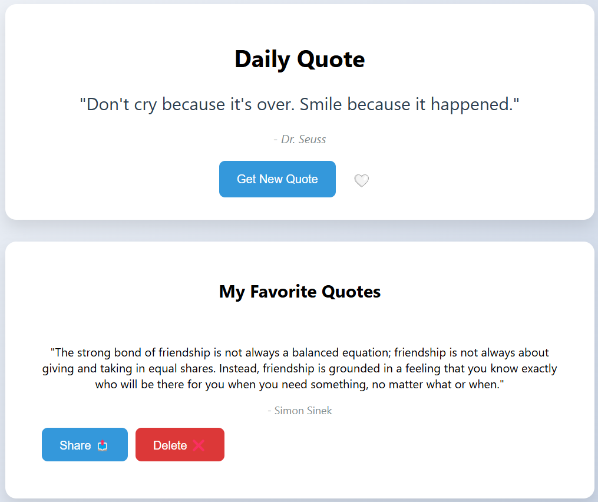

# Daily Quote Generator

A simple and elegant web application that displays inspiring quotes from famous people. Users can fetch new quotes, save their favorites, and share them with others.



## Features

- 🔄 Generate random quotes from a vast collection
- ❤️ Save favorite quotes with local storage persistence
- 🔍 View all saved favorite quotes
- 🗑️ Delete quotes from favorites
- 📤 Share quotes via Web Share API (with clipboard fallback)
- 📱 Fully responsive design for all devices
- ✨ Smooth animations and transitions

## Live Demo

[View Live Demo](https://s4nc0ll1.github.io/DailyQuote/)

## Technologies Used

- HTML5
- CSS3
- JavaScript (ES6+)
- [Quotable API](https://github.com/lukePeavey/quotable) for quote generation
- Local Storage for data persistence
- Web Share API for sharing functionality

## Installation

1. Clone the repository:
```bash
git clone https://github.com/s4nc0ll1/DailyQuote.git
```

2. Navigate to the project directory:
```bash
cd DailyQuote
```

3. Open `index.html` in your preferred browser or use a local server.

## Usage

1. Click "Get New Quote" to generate a random quote
2. Click the heart icon to save a quote to your favorites
3. View your saved quotes in the "My Favorite Quotes" section
4. Share quotes using the share button
5. Remove quotes from favorites using the delete button

## API Reference

This project uses the [Quotable API](https://github.com/lukePeavey/quotable) to generate random quotes.

Endpoint used:
```
GET https://api.quotable.io/random
```

## Contributing

Contributions are welcome! Here's how you can help:

1. Fork the repository
2. Create a new branch (`git checkout -b feature/improvement`)
3. Make your changes
4. Commit your changes (`git commit -am 'Add new feature'`)
5. Push to the branch (`git push origin feature/improvement`)
6. Create a Pull Request

## License

This project is licensed under the MIT License - see the [LICENSE](LICENSE) file for details.

## Acknowledgments

- [Quotable API](https://github.com/lukePeavey/quotable) for providing the quotes
- Icons from [Emoji](https://emojipedia.org/)

## Contact

Santiago Collantes Zuluaga - [LinkedIn](https://www.linkedin.com/in/santiago-collantes-zuluaga/)

Project Link: [https://github.com/s4nc0ll1/DailyQuote](https://github.com/s4nc0ll1/DailyQuote)